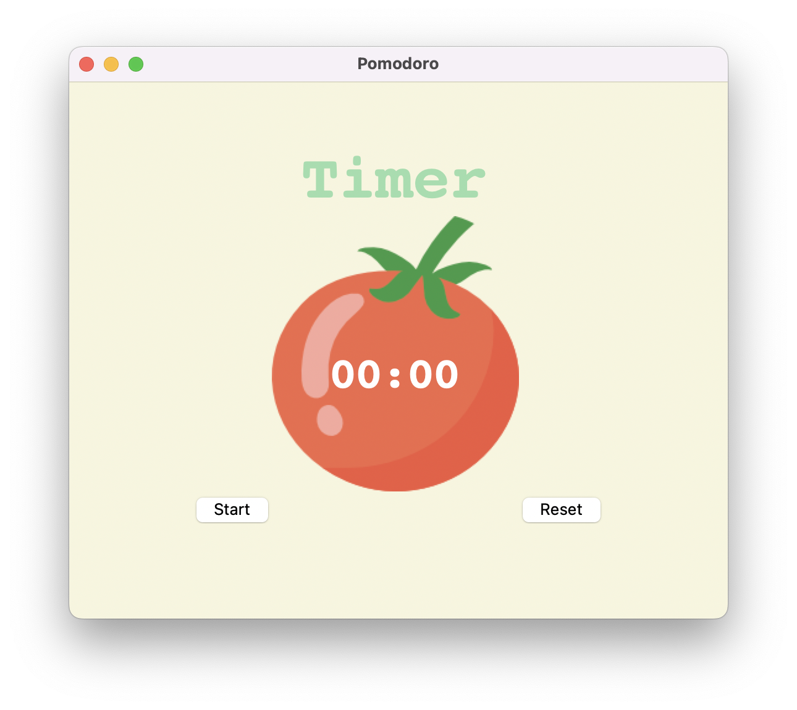

# Pomodoro Timer App

## Description

The Pomodoro Timer App is a simple productivity tool built with Python and Tkinter for the user interface. The app follows the Pomodoro Technique, a time management method developed by Francesco Cirillo in the late 1980s. It encourages working in short, focused intervals (known as "pomodoros") separated by breaks, promoting improved productivity and mental agility.

## Features

- **Pomodoro Timer:** Set custom work intervals to stay focused on tasks.
- **Break Timer:** Take short breaks between work intervals for relaxation.
- **User-friendly Interface:** Built with Tkinter for a simple and intuitive user experience.

## Screenshots

